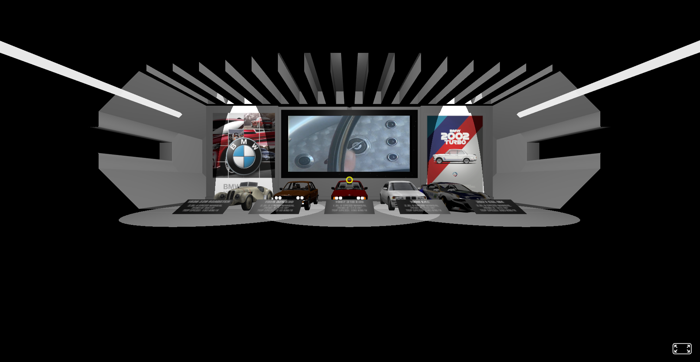
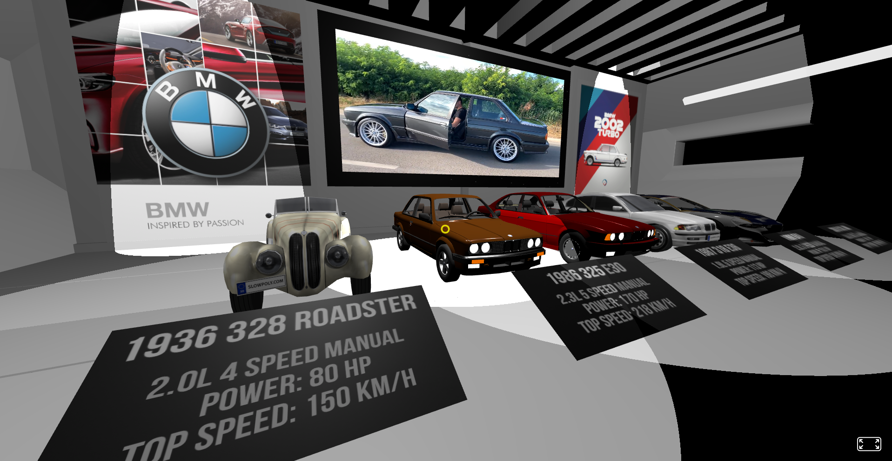
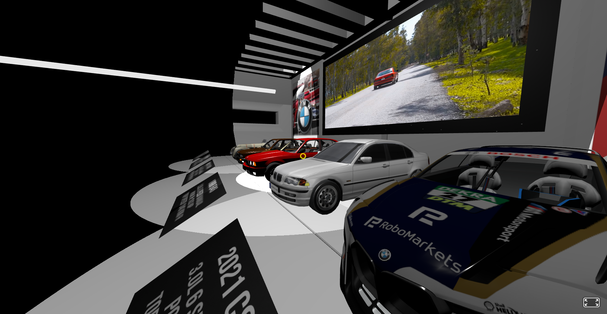
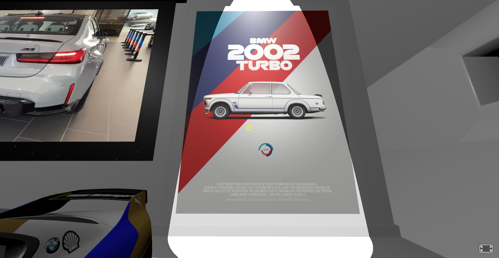

# BMW Car Museum

The "BMW Car Museum" project is a web-based virtual museum showcasing BMW's automotive history.
It features 3D models of iconic BMW cars from 1936 to 2021, including the 1936 BMW 328 Roadster and the 2021 BMW CSL Hommage R.
Each model is accompanied by detailed information, images, and videos, providing an interactive experience for enthusiasts.
The project utilizes HTML and integrates Sketchfab for 3D model rendering.

